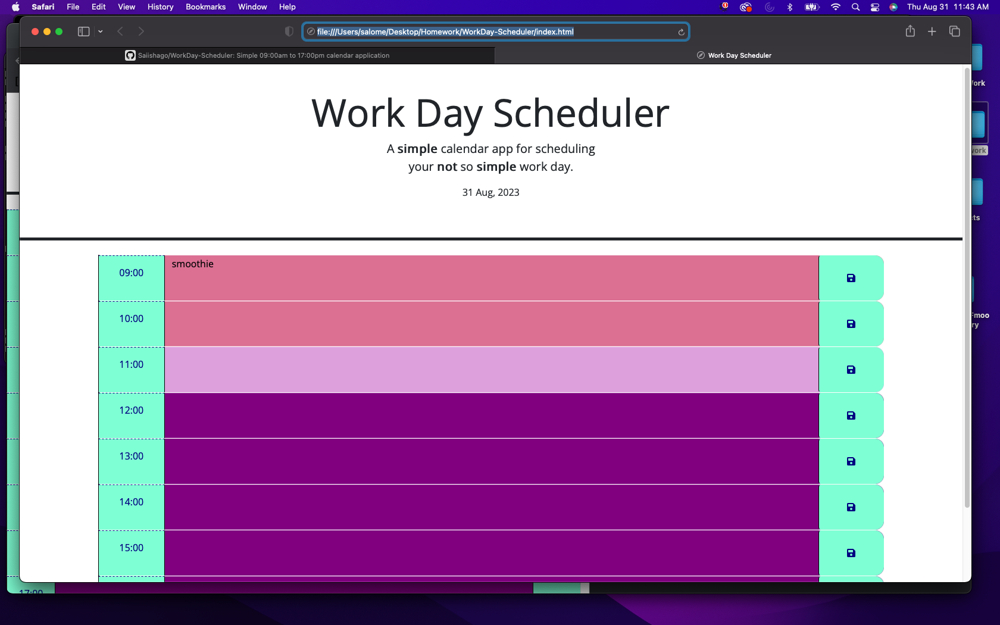

# WorkDay-Scheduler
Simple 09:00am to 17:00pm work day calendar application. We are given starter code and we have to modify it.

Links and Screenshots:

Github:

https://github.com/Saiishago/WorkDay-Scheduler

Deployed Link: 

https://saiishago.github.io/WorkDay-Scheduler/

Screenshots:

